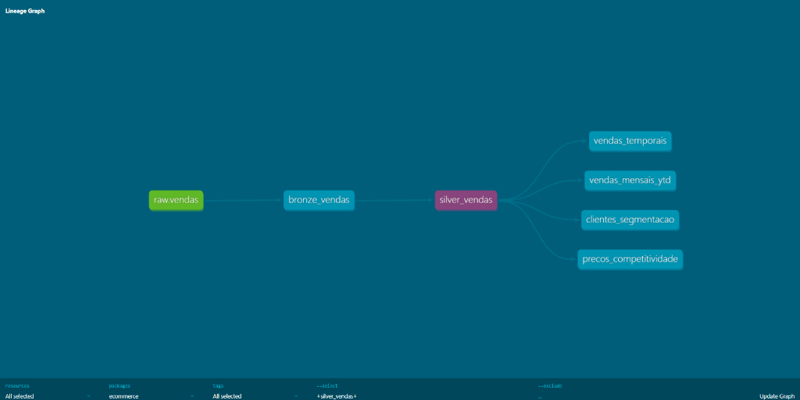

# 🧱 Módulo 01: Camada de Transformação (dbt Core)

Este módulo é responsável por todo o processo de **Engenharia de Transformação** da suíte. Utilizamos o **dbt (Data Build Tool)** para converter dados brutos em tabelas ricas e prontas para consumo analítico.

## 🏗️ Modelagem: Arquitetura Medalhão

Implementamos o padrão de medalhão para garantir a qualidade e a linhagem dos dados:

1.  **Bronze (Raw Mirror)**: Espelhamento fiel das tabelas de origem (`vendas`, `produtos`, `clientes`, `preco_competidores`). Serve como camada de staging e contrato de dados.
2.  **Silver (Cleaned & Augmented)**: Dados limpos e padronizados. Adicionamos colunas calculadas (Ex: faixas de preço, datas formatadas) e garantimos a integridade de tipos.
3.  **Gold (Data Marts)**: Camada de entrega. Aqui realizamos os JOINs finais e agregações para responder perguntas de negócio específicas:
    - `sales`: KPIs de faturamento e volume temporal.
    - `customer_success`: Segmentação RFM e ranking de clientes.
    - `pricing`: Análise de competitividade vs mercado.



## 🧪 Qualidade e Governança

- **Data Tests**: Implementamos testes automatizados do dbt (unique, not_null, relationship) para garantir que a Camada Gold nunca receba dados inconsistentes.
- **Documentação**: Todo o dicionário de dados é gerado automaticamente.

## 🚀 Como Executar

1.  Certifique-se de que o ambiente virtual está ativo.
2.  Configure seu `profiles.yml` para conectar ao Supabase.
3.  Comandos principais:
    ```bash
    dbt run   # Executa o pipeline completo
    dbt test  # Valida a integridade dos dados
    dbt docs generate && dbt docs serve # Gera e abre a linhagem (DAG)
    ```

---
*Módulo desenvolvido com foco em escalabilidade e manutenção de código SQL limpo.*
