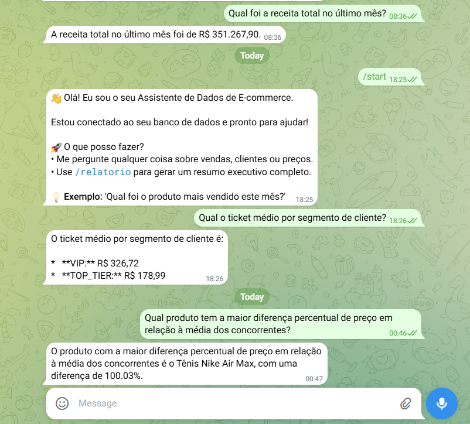

# 🤖 Módulo 3: Data Agent & Automação (Gemini AI)

Este módulo eleva o projeto para o próximo nível, utilizando Inteligência Artificial Generativa para democratizar o acesso aos dados através de uma interface de conversação natural via **Telegram**.

## 🧠 Inteligência Artificial

Utilizamos a API do **Google Gemini** para atuar como um analista de dados assistente. 
- **Linguagem Natural**: O usuário pode perguntar "Qual meu produto mais caro?" ou "Quanto vendemos ontem?", e o agente traduz isso em queries SQL contra o banco de dados.
- **Contexto**: O agente conhece a estrutura das tabelas Gold e responde de forma executiva.

## 📱 Interface Telegram

- **Relatórios On-demand**: Receba métricas rápidas direto no celular.
- **Automação**: O bot está configurado para interagir com a API do Telegram utilizando a biblioteca `python-telegram-bot`.



## 🚀 Como Executar

1.  Acesse a pasta do módulo e instale as dependências.
2.  Configure o arquivo `.env` com as chaves:
    - `GOOGLE_API_KEY` (Gemini)
    - `TELEGRAM_TOKEN` (BotFather)
    - `SUPABASE_URL` 
3.  Inicie o bot:
    ```bash
    python bot.py
    ```

---
*Módulo focado em inovação e redução da barreira técnica para consumo de dados.*
