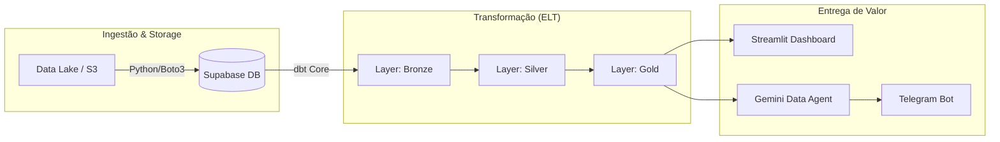
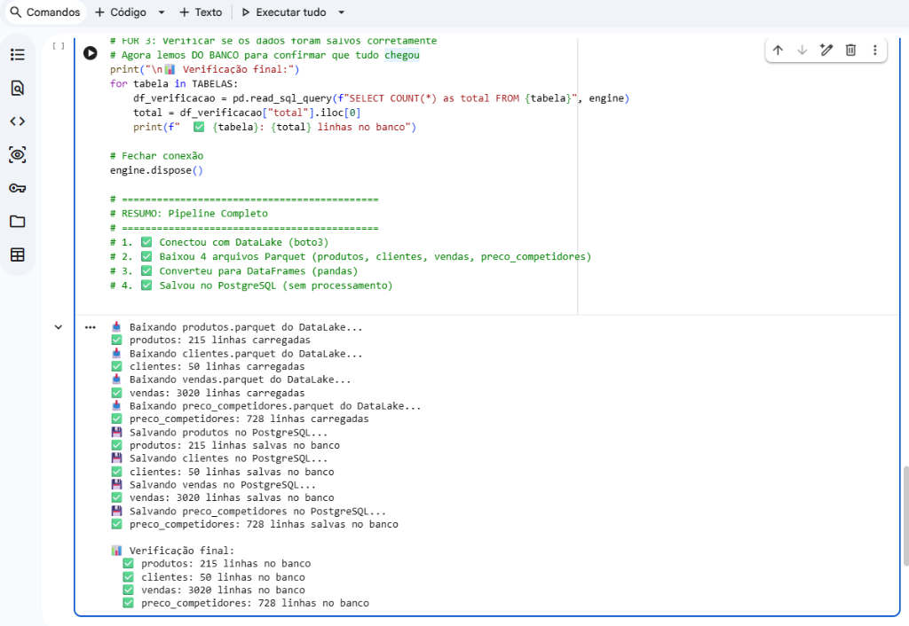
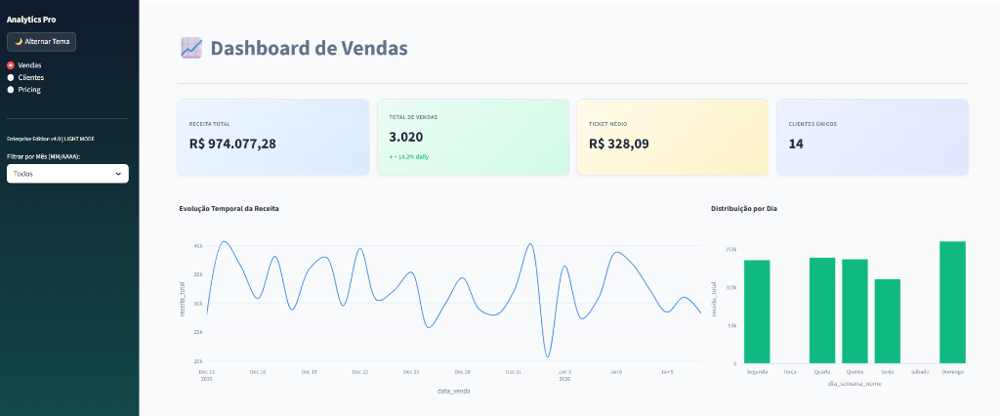

# E-commerce Intelligence Suite: End-to-End Data Engineering & AI 🚀

Uma solução completa de inteligência de dados para e-commerce, projetada para transformar dados brutos em decisões estratégicas através de um pipeline moderno, dashboards reativos e agentes inteligentes de IA.

---

## 📌 Visão Geral do Projeto

Este repositório apresenta um ecossistema de dados resiliente, construído para resolver o desafio clássico de centralizar e processar dados transacionais e de mercado. O projeto abrange desde a **Ingestão Automática** até a camada de **Data Analytics** e **GenAI**, permitindo que gestores acessem métricas vitais via dashboard ou conversação natural.

## 🏗️ Arquitetura da Solução

O projeto segue os princípios do **Modern Data Stack**, utilizando uma **Arquitetura Medalhão** (Bronze, Silver, Gold) para garantir a governança e qualidade dos dados.

---

## 🛠️ Etapas do Pipeline

### 1. Ingestão de Dados (Python & Colab)
O processo inicia com a extração de arquivos **Parquet** de um Data Lake (S3). Utilizamos Python para automatizar a carga desses dados no **Supabase**, garantindo que as tabelas brutas estejam prontas para a transformação.

> **📸 Visualização do Processo de Ingestão:**
> 

### 2. Transformação e Modelagem (dbt)
Transformamos dados brutos em inteligência através da Arquitetura Medalhão.
- **Linhagem de Dados:** Garantia de rastreabilidade completa.

---

## 📂 Módulos do Repositório

### [01-Pipeline-dbt](./01-pipeline-dbt)
Transformação de dados utilizando o **dbt Core**. 
- Implementação da **Arquitetura Medalhão** para desacoplar ingestão de lógica de negócio.
- **Camada Gold**: Data Marts focados em Vendas, Customer Success e Pricing.
- Aplicação de **Data Quality Tests** e versionamento de modelos SQL.

### [02-Dashboard-Streamlit](./02-dashboard-streamlit)
Camada de visualização interativa construída em **Python**.
- Dashboards reativos para análise de performance de vendas e pricing competitivo.
- Implementação de temas dinâmicos (Light/Dark Mode).

### [03-Telegram-Bot-Gemini](./03-telegram-bot-gemini)
Integração de Inteligência Artificial Generativa (**Google Gemini API**).
- Agente de dados disponível no Telegram.

---

## 🛠️ Stack Técnica

- **Linguagens**: Python, SQL.
- **Data Warehouse & Cloud**: Supabase (PostgreSQL).
- **Processamento & Modelagem**: dbt Core, Pandas, SQLAlchemy.
- **Visualização**: Streamlit, Plotly.
- **AI & Messaging**: Google Gemini API, Telegram Bot API.

---

## 🚀 Como Executar este Projeto

O repositório está organizado para que cada módulo possa ser testado individualmente:

1.  **Pré-requisitos**:
    - Python 3.10+ instalado.
    - Uma instância do Supabase (ou Postgres).
    - API Keys do Gemini e Telegram (para o módulo 03).

2.  **Configuração de Ambiente**:
    - Clone o repositório.
    - Crie arquivos `.env` em cada pasta seguindo os modelos `.env.example`.
    - Instale as dependências: `pip install -r requirements.txt`.

3.  **Execução**:
    - Siga as instruções específicas nos READMEs de cada módulo.

---

## 🎯 Impacto e Resultados

- **Governança**: Transformação de dados brutos em "Single Source of Truth" via dbt.
- **Agilidade**: Respostas automáticas de negócio via IA, reduzindo a dependência de queries manuais.
- **Competitividade**: Monitoramento de pricing versus concorrência em tempo real.

---

### 👤 Autor
Desenvolvido por **Danilo Rezende** como resultado da imersão técnica na **Jornada de Dados**.

- [LinkedIn](https://www.linkedin.com/in/danilorezend/)
- [Portfólio GitHub](https://github.com/danilorezende25)

---
*Este projeto foi desenvolvido utilizando boas práticas de Engenharia de Dados e sob a mentoria de Luciano Galvão.*
